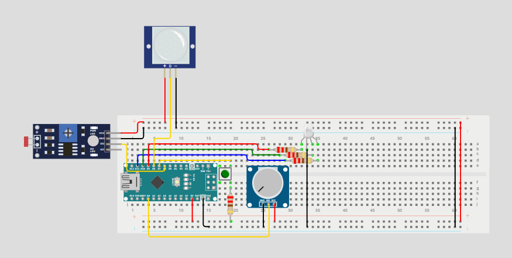

# Умная RGB-лампа на Arduino Nano

Проект многофункциональной светодиодной лампы, которая автоматически загорается при наступлении темноты и обнаружении движения, а также позволяет вручную регулировать цветовую гамму свечения с помощью потенциометра.Лампа имеет несколько режимов переключения между которыми непосредственно происходит по нажатию кнопки

## Оглавление
- [Функциональные возможности](#функциональные-возможности)
- [Комплектующие](#комплектующие)
- [Схема подключения](#схема-подключения)
- [Программная часть](#программная-часть)
- [Используемые библиотеки](#используемые-библиотеки)
- [Возможные улучшения](#возможные-улучшения)

## Функциональные возможности
- **Автоматическое включение при движении в темноте:** если датчик освещённости фиксирует низкий уровень света или PIR-датчик обнаруживает движение, RGB-светодиод загорается
- **Настраиваемая задержка выключения:** после последнего зафиксированного движения лампа продолжает светиться заданное время (по умолчанию 30 секунд) 
- **Ручная регулировка цвета:** во время свечения пользователь может вращением потенциометров  цветовую гамму (оттенок) светодиода
- **Кнопка для переключения режимов свечения** можео сатроить несколько цветов и переключаться между ними
## Комплектующие
| Компонент | Количество | Примечание |
|-----------|------------|------------|
| Arduino Nano | 1 | Любая версия на ATmega328P |
| RGB-светодиод  | 1 | С общим катодом  |
| Резисторы  | 4 |  220 Ом для каждого канала светодиода(3) и кнопки(1) |
| Потенциометр | 1 | Для регулировки цветовой гаммы |
| Модуль датчика освещённости  | 1 | MH-Sensor-Series |
| PIR-датчик движения | 1 | HC-SR501 или аналог |
| Источник питания 5V | 1 | USB-кабель или внешний блок питания |
| Кнопка | 1 | из базового набора Ардуино |
## Схема подключения
Схема подключения в формате Json для Wokwi находиться в файле СхемаLampaFinal.txt

**Основные соединения:**
- **RGB-светодиод:**  
  Красный канал – пин D9 (ШИМ), через резистор на 220 Ом  
  Зелёный канал – пин D10 (ШИМ), через резистор на 220 Ом    
  Синий канал – пин D11 (ШИМ), через резистор на 220 Ом     
  Общий провод – GND (для общего катода) или +5V (для общего анода) 
- **Потенциометр:** центральный вывод к A0, крайние к +5V и GND 
- **Датчик освещённости (фоторезисторный модуль):** к пину D6, питание +5V, GND
- **PIR-датчик движения:** цифровой выход к D8, питание +5V, GND
- **Кнопка** с одной стороны: резистор в +5V и првод на GND.C другой: напротив резистора сигнальный провод к D7

## Программная часть
Прокрамма находится в папке Lampa_Final
#include <RGBrejim.h>
int movement=8;
int fotores=6;
RGBrejim RGB(7,9,10,11);
int pot=A0;
unsigned long Timer = 0;
bool On=false;
bool Speedmovement=false;
bool Actimer=false;
int Rpot;
int Gpot;
int Bpot;
void setup() {
 Serial.begin(9600);
}
void LightPot(){
  int pokazpot=analogRead(pot);
int  LightSvet=map(pokazpot,0,1023,0,255);
  switch(RGB.getLong()){
    case 1:{
      Rpot=LightSvet;
      break;
    }
    case 2:{
      Gpot=LightSvet;
      break;
    }
    case 3:{
      Bpot=LightSvet;
      break;
    }
    case 4:{
      RGB.ResetLong();
      break;
    }
  }
}
void loop() {
bool  fotoresPokas=digitalRead(fotores);
  //Serial.print(fotoresPokas);
  if(!Actimer){
  if (fotoresPokas==true){
    On=true;
  } else {
    On=false;
  }}
Speedmovement=digitalRead(movement);
  if (Speedmovement==true){
    Actimer=true;
    Timer=millis();
  }
  if(On==true){
 LightPot();
 RGB.RGBsvet(Rpot,Gpot,Bpot);
  } else {
    RGB.RGBoff();
  }
  if(Actimer){
  if(millis()-Timer>=30000){
     On=false;
     Actimer=false;
     } else {
      On=true; 
     }
  } 
  Serial.print(analogRead(pot));
}
## Используемые библиотеки
В проекте использованны такие кастомные библиотеки как:ButtonV2 и RGBrejim которые находятся в папке Libraries
## Возможные улучшения
В будущем: li-Ion батарейка(18650 или любая другая) и модуль контроля зарядки TP4056 или BMS плата,
3D модели корпуса для печати, улучшение работы режима с регулировкой цветовой гаммы(сейчас работает криво)