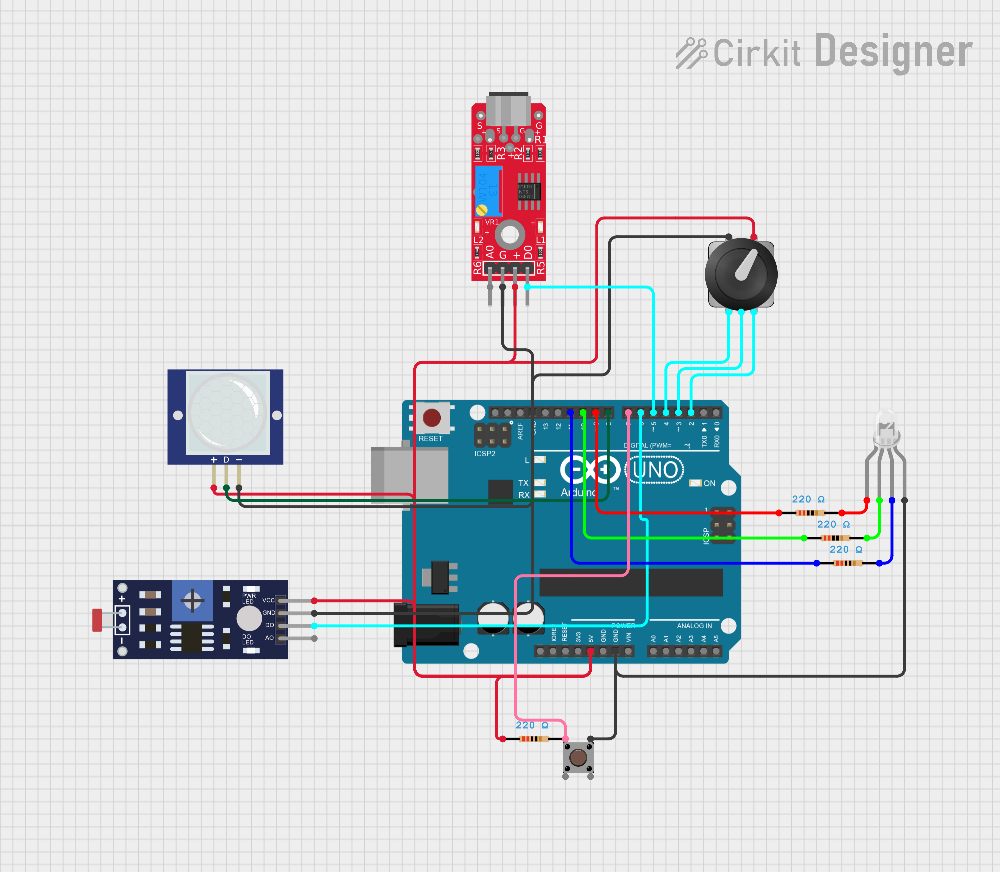

# Умная RGB-лампа на Arduino Nano

Проект многофункциональной светодиодной лампы, которая автоматически загорается при наступлении темноты и обнаружении движения или по хлопку. Управление яркостью каналов RGB осуществляется вращением энкодера, а переключение режимов — его встроенной кнопкой. Настройки сохраняются в энергонезависимой памяти и не сбрасываются при выключении питания.

## Оглавление
- [Функциональные возможности](#функциональные-возможности)
- [Комплектующие](#комплектующие)
- [Схема подключения](#схема-подключения)
- [Программная часть](#программная-часть)
  - [Используемые библиотеки](#используемые-библиотеки)
  - [Описание алгоритма](#описание-алгоритма)
  - [Код программы](#код-программы)
- [Пример использования](#пример-использования)
- [Возможные улучшения](#возможные-улучшения)

## Функциональные возможности
- **Автоматическое включение при движении в темноте:** если датчик освещённости фиксирует низкий уровень света И PIR-датчик обнаруживает движение, RGB-светодиод загорается.
- **Настраиваемая задержка выключения:** после последнего зафиксированного движения лампа продолжает светиться заданное время (по умолчанию 30 секунд).
- **Ручная регулировка цвета:** во время свечения пользователь может вращением энкодера менять цветовую гамму (оттенок) светодиода.
- **Кнопка для переключения режимов свечения:** можно настроить несколько цветов и переключаться между ними нажатиями кнопки.
- **Сохранение энергии:** в режиме ожидания лампа не горит.
- **Сохранение значений в EEPROM** после перезапуска платы настроенный цвет не сбрасывается.
- **Включение по хлопку**Датчик звука KY-037 можно настроить на порог срабатывания, к примеру по охлопку

## Комплектующие
| Компонент | Количество | Примечание |
|-----------|------------|------------|
| Arduino Nano | 1 | ATmega328P |
| RGB-светодиод (общий катод) | 1 | Можно с общим анодом, см. код |
| Резисторы 220 Ом | 3 | По одному на каждый канал светодиода |
| Энкодер | 1 | С кнопкой (замена потенциометра) |
| Резистор 10 кОм | 1 | Для подтяжки кнопки энкодера (если не используется внутренняя) |
| Модуль датчика освещённости | 1 | MH-Sensor-Series (цифровой выход) |
| PIR-датчик движения | 1 | HC-SR501 |
| Датчик звука KY-037 | 1 | Цифровой выход, порог настраивается подстроечником |
| Источник питания +5 В | 1 | USB-кабель или внешний блок питания |
| Макетная плата и провода | набор | |
## Схема подключения
Ссылка на проект в симуляторет https://app.cirkitdesigner.com/project/339514fe-f592-4ff2-9c64-2bccdbc9af97
Выдает ошибку если загружать ту программу которая дана, загружайте бинарный файл с пк.


### Основные соединения:
- **RGB-светодиод:**  
  Красный канал – пин **D9** (ШИМ) через резистор 220 Ом  
  Зелёный канал – пин **D10** (ШИМ) через резистор 220 Ом  
  Синий канал – пин **D11** (ШИМ) через резистор 220 Ом  
  Общий катод подключается к **GND**.
- **Потенциометр:** центральный вывод к аналоговому пину **A0**, крайние к **+5V** и **GND**.
- **Датчик освещённости:** цифровой выход к пину **D6**, питание **+5V** и **GND**.
- **PIR-датчик движения:** цифровой выход к пину **D8**, питание **+5V** и **GND**.
- **Кнопка:** одна ножка через резистор 220 Ом к **+5V** и напрямую к **GND**, другая ножка (сигнальная) к пину **D7**.
- **Датчик звука KY-037** выход D0 к пину **D5**

> **Важно:** фоторезисторный модуль MH-Sensor-Series выдаёт цифровой сигнал (HIGH/LOW). Порог срабатывания настраивается подстроечным резистором на самом модуле.Тоже относится и к датчику звука KY-037.

## Программная часть

### Используемые библиотеки
В проекте используются две самописные библиотеки, которые находятся в папке [`Libraries`](./Libraries/):
- **`ButtonV2`** – обработка нажатий кнопки с защитой от дребезга.
- **`RGBrejim`** – управление RGB-светодиодом, поддержка нескольких режимов свечения и плавная регулировка.
- **`Encoder`** - основной функционал энкодера
### Описание алгоритма
1. При старте контроллер ожидает сигнал от датчика освещённости (пин D6). Если на улице темно (сигнал `HIGH`), система переходит в активный режим ожидания движения.
2. Как только PIR-датчик (пин D8) фиксирует движение, запускается таймер на 30 секунд, и RGB-светодиод включается с текущими настройками цвета.
3. Пользователь может вращать потенциометр (A0), чтобы регулировать яркость красной, зелёной или синей составляющей (в зависимости от выбранного режима).При вращении потенциометра в активном режиме регулировки меняется соответствующий канал, значение сразу сохраняется в EEPROM.
4. Короткое нажатие кнопки (пин D7) циклически переключает режимы: «регулировка R» → «регулировка G» → «регулировка B» → «сброс режимов». Текущий режим запоминается в библиотеке `RGBrejim`.
5. Если в течение 30 секунд не было новых движений, лампа автоматически выключается. При повторном движении таймер сбрасывается.
6. Когда освещение становится достаточным (датчик освещённости выдаёт `LOW`), лампа выключается независимо от движения, экономя заряд батареи.

### Код программы
Полный скетч находится в папке `Lampa_Final`. Ниже приведён основной файл программы с комментариями:

```cpp
#include <Encoder.h> 
#include <RGBrejim.h>   
#include <EEPROM.h>   
#include <ButtonV2.h>
Encoder Enc(4,2,3);
const int RedRom = 0;   
const int GreenRom = 1;   
const int BlueRom = 2;   
#define VolumeSensor 5
#define movement 8     
#define fotores 6 
Button EncBut(4); 
int LightSvet = 0;  
RGBrejim RGB(7, 9, 10, 11);  
unsigned long Timer = 0; 
int brightness=0; 
int SummMovement=0; 
bool LedOn = false;         
bool Speedmovement = false; 
bool Actimer = false;      
bool VolumeZnach = false;
bool fotoresPokas;
int Rpot;
int Gpot;
int Bpot;

void setup() {
  Serial.begin(9600);  
  Rpot = EEPROM.read(RedRom);
  Gpot = EEPROM.read(GreenRom);
  Bpot = EEPROM.read(BlueRom);
}

void GammaLed() {
  switch (RGB.getLong()) {
    case 1: {         
          Rpot=brightness;      
      break;
    }
    case 2: {  
          Gpot=brightness;    
      break;
    }
    case 3: {           
          Bpot=brightness;   
      break;
    }
    case 4: {   
       EEPROM.write(RedRom, (byte)Rpot); 
       EEPROM.write(GreenRom, (byte)Gpot);
       EEPROM.write(BlueRom, (byte)Bpot);   
       RGB.ResetLong();
      break;
    }
  }
}

void loop() {
Speedmovement = digitalRead(movement);
VolumeZnach=digitalRead(VolumeSensor);
fotoresPokas = digitalRead(fotores);
brightness=Enc.pollEnc();
  if (!Actimer) {
    if (fotoresPokas == true) {
      LedOn = true;    
    } else {
      LedOn = false;   
    }
  }
  if (Speedmovement) {         
   int TimerDrebezg = millis();
   if(millis() - TimerDrebezg > 3000){ //В реальности датчик движения отправляет значение не один раз, а несколько.3000 - задержка между концом движения и прекращением отправки значения 
       SummMovement++;
       TimerDrebezg=0;
      }  
  }  
  if (Speedmovement || VolumeZnach) {
    Actimer = true;         
    Timer = millis();        
  }
  if (LedOn == true) {
    GammaLed();           
    RGB.RGBsvet(Rpot, Gpot, Bpot);     
  } else {
    RGB.RGBoff();                      
  } 
  if (Actimer) {
    if (millis() - Timer > 30000) {   
      LedOn = false;                      
      Actimer = false;                 
    } else {
      LedOn = true;                       
    }
  }
  if(SummMovement>=4){
    LedOn=false;
  Rpot = 0;
  Gpot = 255;
  Bpot = 255;
  int time=millis();
  if(millis()-time==500){
    Rpot = 0;
  Gpot = 255;
  Bpot = 255;
  }
  }
  if (Enc.EncButton()){
  EEPROM.write(RedRom,255);
  EEPROM.write(GreenRom,255);
  EEPROM.write(BlueRom,255);
  Rpot = 255;
  Gpot = 255;
  Bpot = 255;
  }
}
```
## Пример использования
- Установите лампу в прихожей или на лестнице. Днём она не включается, экономя заряд аккумулятора (если используется автономное питание).
- Вечером, когда освещение падает, достаточно войти в зону действия датчика движения — лампа загорается приятным настроенным цветом.
- С помощью кнопки можно быстро переключаться между заранее заданными цветами, а потенциометр позволит точно настроить оттенок, например, сделать свет более тёплым или холодным.
- Если вы покинули помещение, свет автоматически погаснет через полминуты, и вам не нужно думать о выключении.

## Возможные улучшения
- **Автономное питание**: добавить Li-Ion аккумулятор (18650) с модулем зарядки TP4056 и повышающим преобразователем до 5 В.
- **3D-печатный корпус**: спроектировать и напечатать корпус, в который аккуратно впишутся все компоненты.
- **Улучшение регулировки цвета**: сейчас переключение между каналами R/G/B работает, но можно реализовать плавное изменение оттенка по цветовому кругу (HSV-модель) одним потенциометром, а вторым — яркость.
- **Плавное затухание**: при выключении лампы сделать fade-out для более эстетичного эффекта.
- **Беспроводное управление**: установить модуль ESP8266 или заменить Arduino Nano на ESP32, добавив возможность управления с телефона через веб интерфейс по Wi-Fi или по Bluetooth .